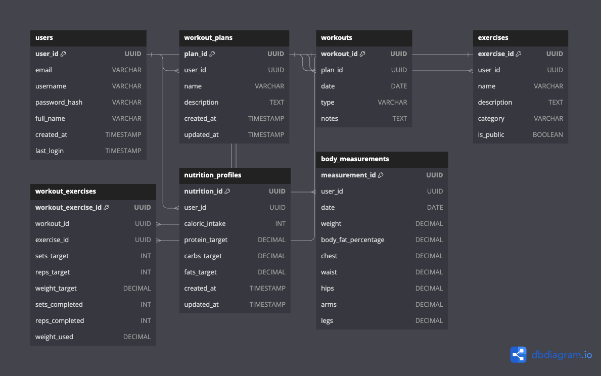

## HackSquat

### Database Schema

### 1. **Workout Planning and Scheduling**

- **Data Model**: I’ll need a robust data model to store workouts, exercises, and user schedules. Consider PostgreSQL as it offers strong relational data handling.
- **User Interface**: A drag-and-drop interface for planning workouts could enhance user experience. Implement this with React, utilizing libraries like `react-beautiful-dnd` for a smooth, intuitive UI.

### 2. **Tracking and Analysis**

- **Lift Progression Logic**: Implement algorithms that analyze past performance and automatically suggest weight increments. This could be based on simple percentage increases or more complex formulas considering the user's rate of progress, workout intensity, and frequency.
- **Dashboard**: Use React to create dynamic, real-time dashboards. Libraries like Recharts or Chart.js can visualize lift history, progress over time, and comparisons between different exercises.

### 3. **Nutritional Guidance**

- **API Integration**: Consider integrating a third-party API for nutritional data to provide accurate caloric intake and macronutrient targets. I could build a basic nutrition calculator based on body measurements and fitness goals.
- **User Profile Customization**: Allow users to input specific goals, dietary restrictions, and preferences to tailor the nutritional guidance to their needs.

### 4. **Additional Features**

- **Barbell Calculator**: A simple JavaScript calculator function can help users quickly determine the plates needed for a given weight. This feature enhances the user's gym experience by simplifying setup times.
- **Notification System**: Implement a notification system using Web Push Notifications to alert users about missed targets or suggest deload periods. This could be based on tracking workout performance and applying logic to determine when a user consistently falls short of their targets.

### Technical Considerations

- **Frontend**: Since I’m familiar with React, Redux, and Vite, these tools will serve well for building a responsive, state-managed UI. Consider using Tailwind CSS or Styled Components for efficient, maintainable styling.
- **Backend**: For the server side, Node.js with Express provides a flexible, scalable foundation. I can structure my API to handle user authentication, data management, and business logic for workout and nutrition calculations.
- **Deployment**: Look into deploying my app on platforms like Heroku or Netlify for the frontend, with PostgreSQL service for my database. Ensure secure HTTPS connections and consider using Docker for easier deployment and scalability.

### Development Strategy

- **MVP (Minimum Viable Product)**: Start with core features (workout tracking, basic nutritional guidance) and iteratively add more complex functionalities (automatic lift progression, detailed analytics).
- **User Testing**: Early and continuous user feedback is crucial. Implement user testing phases to gather insights and adjust my app accordingly.
- **Agile Development**: Adopt an agile development methodology, breaking down the project into sprints with specific goals. This approach helps manage the project's scope and ensures steady progress.

Dashboards

### 1. **Workout Planning and Design Dashboard**

- **Exercise Library**: Ensure I have a diverse and comprehensive library of exercises that users can choose from. This library could include categorizations such as muscle group, equipment needed, and difficulty level.
- **Template Workouts**: Offer pre-designed workout templates for various goals (e.g., strength, hypertrophy, endurance) to help users get started or provide inspiration.
- **Customization**: Allow for high customization of workouts, including the ability to add notes or special instructions for each exercise, which can be useful for users with specific needs or injuries.

### 2. **Workout Tracker**

- **Rest Timer**: Incorporate a rest timer feature that users can start after completing a set. This helps users stick to their rest interval plans without needing a separate timer.
- **Feedback System**: After completing a workout session, prompt users to input how the session felt (e.g., too easy, just right, too hard). Use this feedback to adjust future workout suggestions or weight targets.
- **Social Sharing**: Consider adding functionality for users to share their workouts or achievements on social media. This can add a motivational aspect and community feel.

### 3. **User Dashboard**

- **Goal Setting and Tracking**: Allow users to set specific fitness goals (e.g., reach a certain weight for a lift, achieve a body weight target) and track their progress toward these goals.
- **Integration with Wearables**: If possible, consider integrating with fitness wearables or apps to pull in additional data like daily activity, heart rate, or sleep patterns, which can provide a more holistic view of the user's health and fitness.
- **Recovery Insights**: Based on workout intensity and frequency, provide insights or recommendations on recovery, including suggested rest days or lighter workout periods to prevent overtraining.

### Additional Considerations

- **Accessibility Features**: Ensure your app is accessible to a wide range of users, including those with disabilities. This could involve screen reader compatibility, high-contrast modes, and scalable text.
- **Community Features**: Adding a community aspect, like forums, workout challenges, or leaderboards, can significantly enhance user engagement and retention.
- **Educational Content**: Incorporate articles, videos, or tips on proper form, nutrition, recovery strategies, and other relevant topics to provide value beyond just workout tracking.

### Technical and Design Considerations

- **Responsive Design**: Ensure the app is fully responsive and provides a seamless experience across all devices (desktop, tablet, smartphone).
- **Data Privacy and Security**: Given the personal nature of the data the app will handle, prioritize strong security measures and transparent privacy policies to protect user information.
